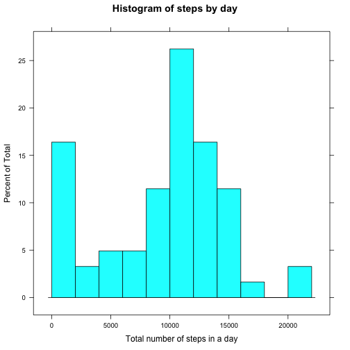
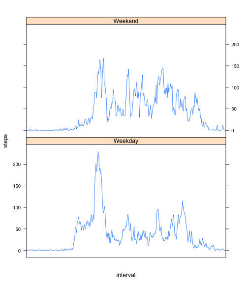

# Reproducible Research: Peer Assessment 1


```r
# First let's do some setup.
library(knitr)
library(ggplot2)
library(plyr)
library(lattice)
opts_chunk$set(echo = TRUE)
```

## Loading and preprocessing the data

Data are loaded from the data directory. The "date" field is processed using `as.Date`.


```r
df <- read.csv("../data/activity.csv")

#Convert dates to Date class.
df$date <- as.Date(df$date)

# Convert time values to strings and add leading zeroes.
df$interval <- sprintf("%04d", df$interval)
```


## What is mean total number of steps taken per day?


```r
total_steps_by_day <- tapply(df$steps, df$date, FUN = sum, na.rm = TRUE)
hist(total_steps_by_day, breaks = 
             seq(0, max(total_steps_by_day) + 2000, by = 2000), 
     xlab = "Total number of steps in a day", main = "Histogram of steps by day")
```

 

```r
mean(total_steps_by_day)
```

```
## [1] 9354
```

```r
median(total_steps_by_day)
```

```
## [1] 10395
```

## What is the average daily activity pattern?


```r
interval_val <- unique(df$interval)
mean_steps_by_time <- data.frame(row.names = interval_val, 
                                 steps = as.numeric(
                                         rep(NA, length(interval_val))))
for (x in interval_val) {
        mean_steps_by_time[x,] = 
                mean(subset(df, interval == x)$steps, na.rm = TRUE)
}

plot(x = rownames(mean_steps_by_time), y = mean_steps_by_time[,1], type = "l")
```

 

The maximum mean steps is at time:


```r
rownames(mean_steps_by_time)[which.max(mean_steps_by_time$steps)]
```

```
## [1] "0835"
```

## Imputing missing values

There are this many intervals with missing values:


```r
sum(is.na(df$steps))
```

```
## [1] 2304
```


```r
# Duplicate df.
filled_df <- df

# Look up mean steps at that time for NA values.
for (x in which(is.na(filled_df$steps))) {
        filled_df[x,]$steps <- 
                as.integer(mean_steps_by_time[filled_df[x,]$interval,])
}


total_filled_steps_by_day <- 
        tapply(filled_df$steps, filled_df$date, FUN = sum, na.rm = FALSE)
hist(total_filled_steps_by_day, breaks = 
             seq(0, max(total_filled_steps_by_day) + 2000, by = 2000), 
     xlab = "Total number of steps in a day", 
     main = "Histogram of steps by day, with missing data imputed")
```

 

```r
mean(total_filled_steps_by_day)
```

```
## [1] 10750
```

```r
median(total_filled_steps_by_day)
```

```
## [1] 10641
```


## Are there differences in activity patterns between weekdays and weekends?

First, add in the day of the week to the data frame.

```r
weekends <- c("Saturday", "Sunday")
filled_df$weekday <- as.factor(ifelse(weekdays(filled_df$date) %in% weekends, 
                               "Weekend", "Weekday"))
```


```r
mean_steps_by_time_weekday <- data.frame(row.names = interval_val, 
                                 steps_weekday = as.numeric(
                                         rep(NA, length(interval_val))),
                                 steps_weekend = as.numeric(
                                         rep(NA, length(interval_val))))
for (x in interval_val) {
        mean_steps_by_time_weekday[x,]$steps_weekday = 
                mean(subset(filled_df, interval == x 
                            & weekday == "Weekday")$steps, na.rm = FALSE)
        mean_steps_by_time_weekday[x,]$steps_weekend = 
                mean(subset(filled_df, interval == x 
                            & weekday == "Weekend")$steps, na.rm = FALSE)       
}

plot(x = rownames(mean_steps_by_time_weekday), 
     y = mean_steps_by_time_weekday$steps_weekday, 
     type = "l", col = "red")
lines(x = rownames(mean_steps_by_time_weekday), 
      y = mean_steps_by_time_weekday$steps_weekend, 
      type = "l", col = "blue")
```

 
